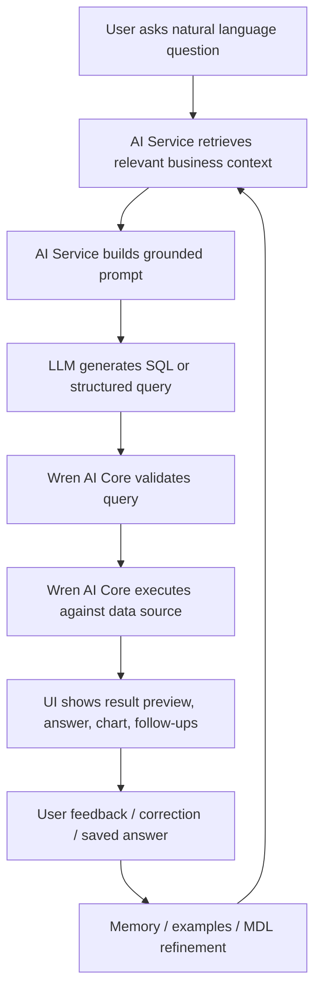

# Wren.ai Yapay Zeka ile Sorgu Oluşturma Motoru — Araştırma ve Model Kontrol Dokümanı

> Amaç: Bu doküman, Wren.ai'nin doğal dil ile SQL/sorgu üretme yaklaşımını teknik olarak özetler ve kendi Text-to-SQL / BI query modelinizi kontrol ettirmek için yapay zekaya verilebilecek bir referans checklist sağlar.
>
> Kapsam: Wren AI OSS / Wren AI Core mimarisi, MDL semantic layer yaklaşımı, retrieval + prompting + SQL generation + validation akışı, feedback/memory kavramları ve Biqly benzeri bir sistem için uygulanabilir tasarım kriterleri.
>
> Not: Wren dokümantasyonu 2026 itibarıyla bazı isim değişiklikleri içeriyor. Eski adı **Wren Engine**, yeni dokümantasyonda çoğunlukla **Wren AI Core** olarak geçiyor. GenBI Docker tabanlı eski uygulama tarafı için “sunset/legacy” notları bulunuyor; aktif açık çekirdek daha çok context layer / agent integration / CLI / SDK ekseninde ilerliyor.

---

## 1. Kısa Özet

Wren.ai'nin sorgu üretme yaklaşımı klasik “LLM'e schema dump ver, SQL yazdır” modelinden farklıdır. Temel fikir şudur:

```text
Raw DB Schema  →  Semantic / Context Layer  →  Context Retrieval  →  SQL Generation  →  Validation / Execution  →  Feedback / Memory
```

Wren, LLM'in doğrudan ham tablo/kolon isimleri üzerinden tahmin yapmasını istemez. Bunun yerine veritabanı üstüne **MDL (Modeling Definition Language)** adlı machine-readable bir semantic contract koyar. Bu contract modelleri, kolonları, hesaplamaları, ilişkileri, metric'leri, view/cube benzeri query interface'lerini ve governance kurallarını açıklar.

Bu sayede LLM şu soruyu sormaz:

> “Hangi tabloyu ve join'i tahmin etmeliyim?”

Bunun yerine şu şekilde çalışır:

> “Bu business question hangi business concept, metric, relationship ve onaylı query path ile cevaplanmalı?”

---

## 2. Ana Bileşenler

### 2.1 Wren UI

Kullanıcının veri kaynağı bağladığı, modelleri/ilişkileri tanımladığı, doğal dilde soru sorduğu, sonuçları, grafikleri ve kaydedilmiş cevapları gördüğü arayüzdür.

Sizin sisteminizde bunun karşılığı:

- React/Vite frontend
- datasource yönetimi
- semantic model yönetimi
- natural language query ekranı
- generated SQL preview
- result preview / chart / dashboard
- saved question / favorite / feedback ekranları

### 2.2 Wren AI Service

Wren dokümantasyonuna göre AI Service şu işleri yapar:

- retrieval
- prompting
- SQL generation
- result validation

Bu servis ham prompt'u doğrudan LLM'e göndermek yerine, soruyu anlamlandırır, ilgili semantic context'i bulur, prompt'u context ile kurar, SQL üretir ve sonucu doğrulama akışına sokar.

Sizin sisteminizde bunun karşılığı:

```text
AIHandler / QueryService
  ├── intent analysis
  ├── semantic context retrieval
  ├── few-shot retrieval
  ├── prompt building
  ├── LLM call
  ├── logical query parsing
  ├── SQL generation
  ├── validation
  ├── execution preview
  └── feedback storage
```

### 2.3 Wren AI Core / Wren Engine

Wren AI Core, semantic/context layer ve execution foundation olarak çalışır. Eski GitHub dokümantasyonunda Wren Engine olarak geçer. Görevi:

- MDL manifest/model bilgilerini okumak
- model, metric, relationship ve access rule bilgisini temsil etmek
- logical/semantic sorguları planlamak
- ANSI SQL / dialect uyarlama / connector execution süreçlerini desteklemek
- validation / dry-plan / query execution primitive'leri sağlamak

Wren Engine tarafında Apache DataFusion tabanlı Rust core, Python binding'leri, ibis-server, MCP server gibi modüller bulunur.

---

## 3. Neden Ham Schema Yetmez?

Ham schema şunları anlatır:

```text
table: orders
columns: status, amount, created_at, customer_id
```

Ama şunları anlatmaz:

- `status = 4` ne demek?
- “aktif müşteri” tanımı nedir?
- revenue hesaplamasında refund düşülecek mi?
- hangi tablo canonical source of truth?
- hangi join path güvenilir?
- hangi kolon kullanıcılara gösterilmemeli?
- hangi metric herkes için aynı tanımla hesaplanmalı?

Wren'in semantic/context layer yaklaşımı bu boşluğu kapatmaya çalışır.

---

## 4. MDL — Modeling Definition Language

### 4.1 MDL'nin rolü

MDL, Wren'in merkezindeki semantic contract'tır. Ham schema “storage structure” anlatırken MDL “business meaning” anlatır.

MDL ile tanımlanabilecek temel kavramlar:

- Models: business-facing entity/table abstraction
- Columns: exposed fields, descriptions, types, primary key bilgisi
- Relationships: güvenilir join path'leri
- Calculated fields: reusable hesaplamalar
- Metrics: standart KPI / ölçüm tanımları
- Views / query-shaped objects: stabil sorgu arayüzleri
- Cubes / pre-aggregations: performans ve metric standardizasyonu
- Access rules: row-level / column-level control
- Instructions: business/operational query guidance
- Examples / memory: geçmiş doğru soru-SQL örnekleri

### 4.2 Basit MDL örneği

```yaml
name: customers
table_reference:
  catalog: biqly
  schema: sales
  table: customers
primary_key: customer_id
columns:
  - name: customer_id
    type: INTEGER
    is_primary_key: true
    description: Unique customer identifier
  - name: first_name
    type: VARCHAR
    description: Customer first name
  - name: customer_lifetime_value
    type: DOUBLE
    description: Total net revenue generated by customer after refunds
```

Bu tanım sayesinde agent/LLM `customers` modelini fiziksel tablo gibi kullanabilir; fakat gerçekte sadece MDL'de expose edilen kolonlara erişir. MDL'de olmayan `email`, `phone`, `identity_number` gibi kolonlar modele dahil edilmezse agent tarafından görünmez olur.

---

## 5. Wren Sorgu Üretim Akışı

Aşağıdaki akış Wren dokümantasyonundaki “What happens when you ask a question” bölümüne göre uyarlanmıştır.



### 5.1 Step 1 — Kullanıcı sorusu

Örnek:

```text
Bu çeyrekte en yüksek net satış yapan 10 müşteriyi getir.
```

### 5.2 Step 2 — Context retrieval

AI Service, soruya göre ilgili context'i bulur:

- customers modeli
- orders / invoices modeli
- net sales metric'i
- refund/return business rule'u
- quarter date filter instruction'ı
- daha önce kabul edilmiş benzer soru-SQL örnekleri
- güvenilir join path

### 5.3 Step 3 — Prompt construction

Prompt yalnızca ham schema değil, seçilmiş ve minimize edilmiş context içermelidir:

```text
User question
Relevant models
Relevant columns
Metric definitions
Join relationships
Business instructions
Few-shot examples
SQL dialect rules
Safety rules
Output contract
```

### 5.4 Step 4 — SQL / logical query generation

Wren doğrudan SQL üretebilir; fakat Biqly gibi sistemlerde daha güvenli pattern şudur:

```text
NL question → LogicalQuery JSON → Query planner → SQL generator
```

Bu yapı LLM'i SQL string üreticisi olmaktan çıkarıp structured query producer haline getirir.

Önerilen contract:

```json
{
  "model": "customers",
  "metrics": ["net_sales"],
  "dimensions": ["customer_name"],
  "filters": [
    { "field": "order_date", "op": "between", "value": "current_quarter" }
  ],
  "order_by": [
    { "field": "net_sales", "direction": "desc" }
  ],
  "limit": 10
}
```

### 5.5 Step 5 — Validation / dry-plan

Wren tarafında validation önemli bir primitive olarak ele alınır. Modelinizde de şu kontroller olmalı:

- model exists mı?
- field/metric exists mı?
- field expose edilmiş mi?
- user access bu field/row için yetkili mi?
- join path var mı?
- metric aggregation doğru mu?
- generated SQL parse edilebiliyor mu?
- only SELECT mi?
- limit var mı?
- dialect uyumlu mu?
- dangerous function / raw SQL injection var mı?

### 5.6 Step 6 — Execution

Execution doğrudan DB'ye veya connector layer'a yapılır. Tavsiye edilen güvenli akış:

```text
dry-run / explain / limit preview → user-visible SQL preview → bounded execution → result metadata → chart suggestion
```

---

## 6. Retrieval Tasarımı

Wren'in yaklaşımında retrieval kritik parçadır. Çünkü tüm semantic layer'ı prompt'a basmak hem pahalı hem de modelin dikkatini dağıtır.

### 6.1 Retrieve edilecek context tipleri

- model metadata
- column descriptions
- relationship definitions
- metric definitions
- calculated fields
- access rules
- approved SQL examples
- accepted historical Q&A
- business glossary
- operational instructions
- value profiles / enum mappings

### 6.2 Hybrid retrieval önerisi

Biqly için önerilen retrieval stratejisi:

```text
1. Lexical match: table/column/metric names, synonyms
2. Vector search: descriptions, business glossary, examples
3. Graph expansion: selected model → relationships → needed dimensions/metrics
4. Rerank: question relevance + access permission + model confidence
5. Context packing: only top relevant context into prompt
```

### 6.3 Context confidence

Her context parçasına skor verin:

```json
{
  "context_id": "metric.net_sales",
  "type": "metric",
  "score": 0.94,
  "reason": "User asked for net sales; exact synonym match found"
}
```

LLM response içinde bu context id'leri referanslanırsa audit/debug kolaylaşır.

---

## 7. Prompt Engineering İlkeleri

Wren yaklaşımına uygun prompt şu kurallara dayanmalı:

1. LLM'e ham database'in tamamını verme.
2. Sadece retrieved semantic context'i ver.
3. Modelden bilinmeyen field/metric uydurmamasını iste.
4. Ambiguous durumda clarification üretmesini iste.
5. Output'u JSON schema ile sınırla.
6. SQL dialect'i açık belirt.
7. Join'leri sadece relationship tanımlarından seçtir.
8. Metric hesaplarını sadece MDL/semantic modelden kullandır.
9. DML/DDL/DCL üretimini yasakla.
10. Generated query için açıklama ve confidence üretmesini iste.

Örnek system instruction:

```text
You are a governed BI query planner. You must only use models, fields, metrics, and relationships provided in the context. Never invent table names, column names, joins, metrics, enum values, or filters. If the user question cannot be answered from the provided context, return NEEDS_CLARIFICATION or UNSUPPORTED. Output must match the LogicalQuery JSON schema.
```

---

## 8. Hallucination Azaltma Mekanizmaları

Wren'in temel iddiası “daha iyi prompt”tan çok “daha iyi context layer”dır. Hallucination azaltma için şu yapı önerilir:

| Risk | Çözüm |
|---|---|
| LLM tablo/kolon uydurur | Allowed model/field whitelist |
| Yanlış join seçer | Relationship graph + approved join path |
| Metric yanlış hesaplanır | Metric definitions / calculated fields |
| Ambiguous business term | Business glossary + clarification mode |
| Hidden PII kolon kullanılır | Column-level access / exposed fields |
| SQL injection / unsafe SQL | LogicalQuery schema + SQL AST validation |
| Dialect hatası | Dialect-aware SQL generator / transpiler |
| Regression | Golden eval set |
| Yanlış result ama SQL valid | Answer validation + sample result sanity check |

---

## 9. Feedback Loop ve Memory

Wren blog/dokümantasyonlarında feedback loop önemli bir tasarım olarak anlatılır. Mantık:

1. Kullanıcı soru sorar.
2. Sistem SQL/cevap üretir.
3. Kullanıcı düzeltme verir veya doğru cevabı onaylar.
4. Bu bilgi memory / examples / instructions / MDL refinement olarak saklanır.
5. Gelecekte benzer sorularda retrieval bu örnekleri kullanır.

Biqly için saklanabilecek öğrenme objeleri:

```json
{
  "question": "Bu ay net satış kaç?",
  "accepted_logical_query": { },
  "accepted_sql": "SELECT ...",
  "semantic_context_ids": ["metric.net_sales", "model.orders"],
  "user_feedback": "refund düşülmeli",
  "status": "accepted",
  "created_by": "analyst",
  "created_at": "2026-05-31"
}
```

---

## 10. Biqly Modelini Kontrol Ettirmek İçin AI'ya Verilecek Checklist

Aşağıdaki checklist'i doğrudan başka bir modele verip sisteminizi inceletebilirsiniz.

### 10.1 Architecture checklist

- [ ] AI query akışı ham SQL üretmek yerine önce structured `LogicalQuery` üretiyor mu?
- [ ] Semantic model DB schema'dan ayrılmış mı?
- [ ] Model, dimension, metric, relationship, calculated field, filter, access rule ayrı kavramlar mı?
- [ ] LLM sadece retrieved context ile sınırlandırılıyor mu?
- [ ] Prompt içinde tüm schema değil, ilgili context subset'i mi var?
- [ ] Query generator SQL dialect bağımsız bir logical layer'dan mı çalışıyor?
- [ ] SQL execution öncesi AST/parser validation var mı?
- [ ] Query yalnızca SELECT/read-only olacak şekilde sınırlandırılmış mı?
- [ ] Row limit / timeout / cost guardrail var mı?
- [ ] Generated SQL, used context ve confidence audit olarak saklanıyor mu?

### 10.2 Semantic layer checklist

- [ ] Her modelin business description'ı var mı?
- [ ] Her dimension/metric açıklamalı mı?
- [ ] Metric definitions reusable ve tek kaynak mı?
- [ ] Join path'ler explicit relationship olarak tanımlı mı?
- [ ] Ambiguous alanlar için synonym / glossary var mı?
- [ ] Enum mapping var mı? Örn. `status = 4 => refunded`
- [ ] PII/sensitive kolonlar semantic layer'da hide edilebiliyor mu?
- [ ] Row-level / column-level access tasarlanmış mı?
- [ ] Versioning var mı?

### 10.3 Retrieval checklist

- [ ] Context retrieval hybrid mi? lexical + vector + graph expansion
- [ ] Similar approved query examples retrieve ediliyor mu?
- [ ] Retrieved context skorlanıyor mu?
- [ ] Context prompt'a sığacak şekilde pack/rerank ediliyor mu?
- [ ] Irrelevant tablolar prompt'tan çıkarılıyor mu?
- [ ] User permission retrieval öncesi veya sonrası uygulanıyor mu?

### 10.4 Prompt/output checklist

- [ ] Modelden JSON schema uyumlu çıktı isteniyor mu?
- [ ] Unknown field/metric invent etmesi yasak mı?
- [ ] Join sadece relationships üzerinden mi seçiliyor?
- [ ] Metric sadece semantic definition'dan mı geliyor?
- [ ] Ambiguous durumda clarification dönebiliyor mu?
- [ ] Explanation ve confidence üretiyor mu?
- [ ] Prompt injection'a karşı user question ile system/context ayrımı net mi?

### 10.5 Validation checklist

- [ ] LogicalQuery schema validation var mı?
- [ ] Model/field/metric whitelist validation var mı?
- [ ] Relationship validation var mı?
- [ ] SQL parser validation var mı?
- [ ] Read-only enforcement var mı?
- [ ] LIMIT zorunlu mu?
- [ ] Timeout/cost guardrail var mı?
- [ ] Access control validation var mı?
- [ ] Result sanity validation var mı?
- [ ] Golden eval regression test var mı?

---

## 11. Biqly İçin Önerilen Referans Mimari

```text
Frontend
  └── Ask AI page
      ├── question input
      ├── generated LogicalQuery preview
      ├── generated SQL preview
      ├── result preview
      ├── feedback / save / favorite
      └── chart suggestion

Backend
  ├── AIHandler
  │   └── Ask(question, datasource, user)
  ├── SemanticCatalog
  │   ├── models
  │   ├── dimensions
  │   ├── metrics
  │   ├── relationships
  │   ├── glossary
  │   └── access rules
  ├── ContextRetriever
  │   ├── lexical search
  │   ├── vector search
  │   ├── relationship graph expansion
  │   └── example retrieval
  ├── PromptBuilder
  ├── LLMClient
  ├── LogicalQueryValidator
  ├── SQLGenerator
  ├── SQLValidator
  ├── QueryExecutor
  ├── FeedbackStore
  └── EvalRunner
```

---

## 12. Örnek AI Review Prompt

Aşağıdaki prompt'u modelinize veya başka bir AI coding agent'a verebilirsiniz:

```text
You are a senior GenBI / Text-to-SQL architect. Review my BI query generation engine against the Wren.ai-style context-layer architecture.

Reference architecture:
- Do not let the LLM query raw schema directly.
- Use a semantic/context layer with models, dimensions, metrics, relationships, calculated fields, glossary, access rules, examples, and memory.
- Use retrieval to select only relevant context for each question.
- Generate a structured LogicalQuery first, not raw SQL directly.
- Validate LogicalQuery against the semantic catalog.
- Generate SQL from LogicalQuery with dialect-aware generator.
- Validate SQL AST before execution.
- Enforce read-only SELECT, row limits, timeouts, access control, and no hidden columns.
- Store generated query, selected context, SQL, execution result metadata, feedback, and accepted corrections.
- Maintain golden eval cases to detect regressions.

Please inspect the codebase and answer:
1. Which parts already match this architecture?
2. Where does the system still rely on raw schema or LLM guessing?
3. Are metrics and joins governed or can the model invent them?
4. Is retrieval scoped, scored, and permission-aware?
5. Is the output structured and schema-validated?
6. Is generated SQL validated by parser/AST and forced read-only?
7. Are row/timeout/cost guardrails implemented?
8. Is feedback reusable as future context?
9. What is the minimal-change implementation plan?
10. Give acceptance criteria and test cases.

Be concrete. Reference files/functions. Do not rewrite the whole system unless necessary. Prefer minimal blast radius.
```

---

## 13. Biqly İçin Minimum Uygulama Planı

### Faz 1 — Semantic contract'ı güçlendir

- `models`, `dimensions`, `metrics`, `relationships` tablolarını netleştir.
- Her metric için formula, aggregation, allowed dimensions, filters tanımı ekle.
- Relationship graph oluştur.
- Sensitive columns için `is_hidden`, `is_pii`, `access_policy` alanları ekle.

### Faz 2 — Retrieval layer

- Model/field/metric lexical search.
- Embedding tabanlı semantic search.
- Approved question-SQL examples store.
- Top-K context packer.

### Faz 3 — LogicalQuery contract

- JSON schema tanımla.
- LLM output'u sadece bu schema'ya zorla.
- Unknown field/metric geldiğinde reject et.

### Faz 4 — SQL generation & validation

- SQL'i LLM yerine backend generator üretsin.
- SQL parser ile read-only kontrolü yap.
- LIMIT/timeout zorunlu olsun.
- Query plan/dry-run opsiyonel eklensin.

### Faz 5 — Feedback + eval

- Accepted query history'yi few-shot retrieval'e bağla.
- User feedback'i instruction/example olarak sakla.
- Golden eval dataset oluştur.
- CI'da eval runner çalıştır.

---

## 14. Kaynaklar

- Wren AI OSS Introduction: https://docs.getwren.ai/oss/overview/introduction
- How Wren AI works: https://docs.getwren.ai/oss/overview/how_wrenai_works
- What is MDL?: https://docs.getwren.ai/oss/concepts/what_is_mdl
- Wren AI Core overview: https://docs.getwren.ai/oss/introduction
- Wren AI Core in GenBI: https://docs.getwren.ai/oss/concept/wren_engine
- Wren AI GitHub repository: https://github.com/Canner/WrenAI
- Wren Engine GitHub archive / repository map: https://github.com/Canner/wren-engine
- Wren blog — LangChain Text-to-SQL challenges: https://www.getwren.ai/post/how-do-you-use-langchain-to-build-a-text-to-sql-solution-what-are-the-challenges-how-to-solve-it
